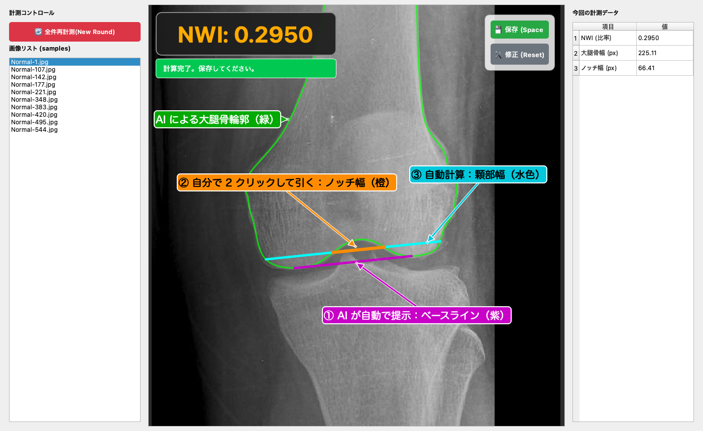

# NWI Semi-Auto — 半自動 NWI 計測ツール

膝関節正面X線画像から **Notch Width Index (NWI)** を計測するための半自動計測ツールです。

**▶ Web 版デモ（インストール不要・ブラウザでそのまま試せます）:**
https://lydrem6fylfjzygah4n2tzb3qi0oaddm.lambda-url.ap-northeast-1.on.aws/

Web 版は AWS Lambda（コンテナイメージ）で動いています。しばらくアクセスがないと停止するため、最初の表示に数秒かかることがあります。



## 画面の見方

| 番号 | 線 | 誰が描くか | 内容 |
|---|---|---|---|
| ① | 紫 | **AI が自動で提示** | ベースライン。左右の大腿骨顆部の下端を結ぶ基準線 |
| ② | 橙 | **自分で引く** | ノッチ幅。2 回クリックで引く。線はベースライン（①）と平行に固定される |
| ③ | 水色 | 自動計算 | 顆部幅。② と同じ高さで大腿骨輪郭（緑）と交わる幅 |
| — | 緑 | AI | 大腿骨の輪郭 |

**NWI = ② ノッチ幅 ÷ ③ 顆部幅**（画像の例：66.41 px ÷ 225.11 px = 0.2950）

AI が提示するのは輪郭とベースラインまでで、どの高さでノッチ幅を測るかは自分で決めます。

> NWI（Notch Width Index）は前十字靭帯（ACL）損傷リスクとの関連が報告されている形態指標です。

## 計測の流れ

1. 左のリストから画像を選ぶ（プレビュー表示）
2. 「計測開始」ボタン または `Enter` → AI が輪郭（緑）とベースライン（①）を表示
3. ノッチ幅（②）を 2 クリックで引く → 顆部幅（③）と NWI が自動で計算される
4. `Space` で保存して次の画像へ（CSV：`Results/nwi_results_v{n}.csv`）

- 「修正 (Reset)」でノッチ幅を引き直せます。保存済みの画像を開くと、前回の線が表示されます。
- 「全件再計測 (New Round)」で新しいラウンドを開始し、結果を別の CSV に保存します（同じ検者による繰り返し計測用）。
- マウスホイールで拡大縮小、右ドラッグで画面移動。

## ファイル構成

| ファイル | 内容 |
|---|---|
| `main.py` | メイン画面（画像リスト、計測状態の管理、CSV 保存） |
| `ui_components.py` | 画像キャンバス（描画、平行固定、ズーム・パン） |
| `algorithms.py` | AI 推論（ONNX Runtime）、輪郭の後処理、ベースライン算出 |
| `utils.py` | CSV のラウンド管理、パス解決 |

## 実行方法

```bash
python -m venv .venv
source .venv/bin/activate        # Windows: .venv\Scripts\activate
pip install -r requirements.txt
python main.py
```

学習済みモデル（`model_b5_384.onnx`）は現在このリポジトリに含めていません（公開準備中）。
モデルがない場合もアプリは起動しますが、AI 解析ステップは実行できません。

## サンプル画像

`samples/` の 10 枚は公開データセット **Multi-Class Knee Osteoporosis X-Ray Dataset**
（Kaggle / Mohamed Gobara, Apache License 2.0）の「Normal」画像です。出典の詳細は
[`samples/ATTRIBUTION.md`](samples/ATTRIBUTION.md) を参照してください。

**臨床画像は一切含まれていません。**

## 注意事項

研究・教育目的のソフトウェアです。医療機器ではなく、診断に使用することはできません。

## License

MIT License（コード）。サンプル画像は元データセットのライセンス（Apache License 2.0）に従います。

---

### English summary

A semi-automatic tool for measuring the Notch Width Index (NWI) on anteroposterior knee radiographs.
Live web demo (AWS Lambda): https://lydrem6fylfjzygah4n2tzb3qi0oaddm.lambda-url.ap-northeast-1.on.aws/
The AI suggests the femoral contour and a baseline (purple); you draw the notch width yourself
(orange), which is kept parallel to the baseline, and the bicondylar width (cyan) and NWI are
computed automatically. Built with PySide6. Sample images are from a public dataset
(Apache 2.0); no clinical images are included.
